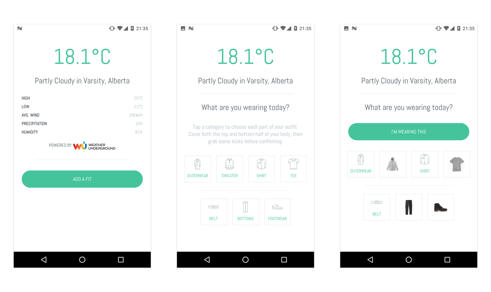

---

### ABOUT

Dress.App is a spare-time project for learning React Native, Redux, Javascript and a bunch of other various libraries.

The app will eventually suggest what to wear based on the current weather conditions and what you tend to wear together.

There are many improvements and features I still want to add, the code could be cleaner in places but that will come with time.

---

### CREDITS

* Weather Forecasts supplied by [Wunderground](https://www.wunderground.com)
* Abel font provided by [Google Fonts](https://fonts.google.com/specimen/Abel) and used under the [SIL Open Font License](https://en.wikipedia.org/wiki/SIL_Open_Font_License)
* Clothing Icons designed by Freepik from [Flaticon](http://www.flaticon.com/packs/clothes-22)

---

### LICENSE

This project is licensed under the terms of the GNU General Public License v3.0
